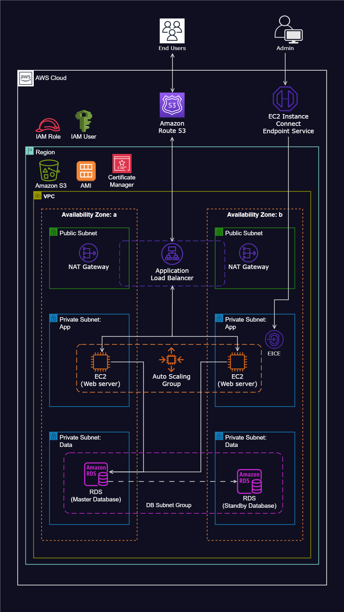

---


# Dynamic Website Hosting on AWS - DevOps Project

This project demonstrates the deployment of a scalable, secure, and fault-tolerant dynamic website using AWS cloud services. The infrastructure is designed to ensure high availability, elasticity, and security. The resources are spread across multiple availability zones and subnets to provide redundancy and fault tolerance.




## Table of Contents
- [Architecture Overview](#architecture-overview)
- [AWS Resources Used](#aws-resources-used)
- [Key Features](#key-features)
- [Deployment Steps](#deployment-steps)
- [Post-Deployment](#post-deployment)
- [Scripts](#scripts)

## Architecture Overview
The website is hosted within a Virtual Private Cloud (VPC) that spans two availability zones to ensure redundancy. EC2 instances in private subnets are configured with an Application Load Balancer to evenly distribute traffic. An Auto Scaling Group dynamically adjusts the number of EC2 instances based on load, while security is managed using Security Groups and AWS Certificate Manager. The website is integrated with Amazon RDS for the database layer and uses Amazon S3 for storing static assets or application code.

## AWS Resources Used
1. **VPC (Virtual Private Cloud)**: Configured with public and private subnets across two availability zones for improved fault tolerance.
2. **Internet Gateway**: Enables outbound connectivity for instances in public subnets.
3. **Security Groups**: Acts as a firewall to control traffic into and out of EC2 instances.
4. **NAT Gateway**: Provides internet access to instances in private subnets.
5. **EC2 Instances**: Hosted in private subnets for enhanced security, used to run the web application.
6. **Auto Scaling Group**: Automatically manages EC2 instances, scaling up or down based on demand to ensure high availability.
7. **Application Load Balancer (ALB)**: Distributes incoming traffic across multiple EC2 instances.
8. **Amazon RDS**: Relational Database Service (RDS) used for storing application data. It is configured with a master and standby instance for high availability.
9. **Amazon S3**: Used to store the application's code and SQL migration files.
10. **Amazon Route 53**: DNS service used to manage the domain and route traffic to the application.
11. **AWS Certificate Manager**: Used to manage SSL/TLS certificates for secure HTTPS communication.
12. **EC2 Instance Connect Endpoint Service**: Provides secure access to resources in both public and private subnets.
13. **Simple Notification Service (SNS)**: Sends notifications related to the Auto Scaling Group activities.
  
## Key Features
- **High Availability**: Resources are spread across two Availability Zones to ensure fault tolerance.
- **Scalability**: The Auto Scaling Group dynamically adjusts the number of EC2 instances based on traffic.
- **Security**: Instances in private subnets enhance security, and traffic is encrypted using SSL certificates.
- **Efficient Resource Utilization**: The NAT Gateway and Application Load Balancer are placed in public subnets to minimize exposure of backend resources.

## Deployment Steps

### Step 1: VPC and Subnet Configuration
1. Set up a VPC with public and private subnets in two availability zones (`a` and `b`).
2. Attach an Internet Gateway to the VPC.
3. Create NAT Gateways in public subnets for instances in private subnets to access the internet.

### Step 2: EC2 Instance Deployment
1. Launch EC2 instances in private subnets for hosting the application.
2. Configure Security Groups to allow traffic from the Application Load Balancer and administrative access (e.g., SSH).
3. Use EC2 Instance Connect Endpoint for secure administrative connections.

### Step 3: Load Balancer and Auto Scaling Group
1. Deploy an Application Load Balancer (ALB) in public subnets and register the EC2 instances in a target group.
2. Set up an Auto Scaling Group to ensure the correct number of EC2 instances are running based on load.

### Step 4: RDS Setup
1. Configure Amazon RDS for the application's database layer. A master database is deployed in one availability zone and a standby in another for high availability.

### Step 5: Domain Registration and SSL Setup
1. Register a domain and configure DNS routing with Route 53.
2. Use AWS Certificate Manager to issue an SSL certificate for secure communication.

### Step 6: S3 for Static Assets
1. Store application code and migration scripts in an S3 bucket.
2. Use the provided script (below) to deploy the database migration using Flyway.

### Step 7: Set Up Monitoring and Notifications
1. Configure Amazon CloudWatch and SNS to monitor the Auto Scaling Group and notify administrators of scaling events or anomalies.

## Post-Deployment
Once the infrastructure is deployed:
- The Application Load Balancer will distribute traffic to the EC2 instances across availability zones.
- The Auto Scaling Group will manage the number of EC2 instances, scaling based on load.
- The NAT Gateway will enable outbound internet access for instances in private subnets.
- Amazon RDS will handle database operations with automatic failover in case of issues.
- SSL termination will be handled at the ALB for secure traffic between clients and the web server.

## Scripts

Below is the script used for migrating the database with Flyway:

```bash
#!/bin/bash

S3_URI=s3://henry4dev-sql-files/V1__shopwise.sql
RDS_ENDPOINT=dev-rds-db.ctw6auwyu0yx.eu-west-2.rds.amazonaws.com
RDS_DB_NAME=applicationdb
RDS_DB_USERNAME=henry
RDS_DB_PASSWORD=ivwighre

# Update all packages
sudo yum update -y

# Download and extract Flyway
sudo wget -qO- https://download.red-gate.com/maven/release/com/redgate/flyway/flyway-commandline/10.9.1/flyway-commandline-10.9.1-linux-x64.tar.gz | tar -xvz 

# Create a symbolic link to make Flyway accessible globally
sudo ln -s $(pwd)/flyway-10.9.1/flyway /usr/local/bin

# Create the SQL directory for migrations
sudo mkdir sql

# Download the migration SQL script from AWS S3
sudo aws s3 cp "$S3_URI" sql/

# Run Flyway migration
flyway -url=jdbc:mysql://"$RDS_ENDPOINT":3306/"$RDS_DB_NAME" \
  -user="$RDS_DB_USERNAME" \
  -password="$RDS_DB_PASSWORD" \
  -locations=filesystem:sql \
  migrate
```

This script downloads the SQL migration file from an S3 bucket, installs Flyway, and runs the migration on the specified RDS instance.

---

